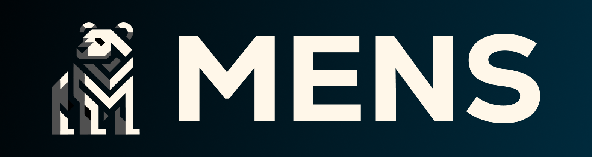
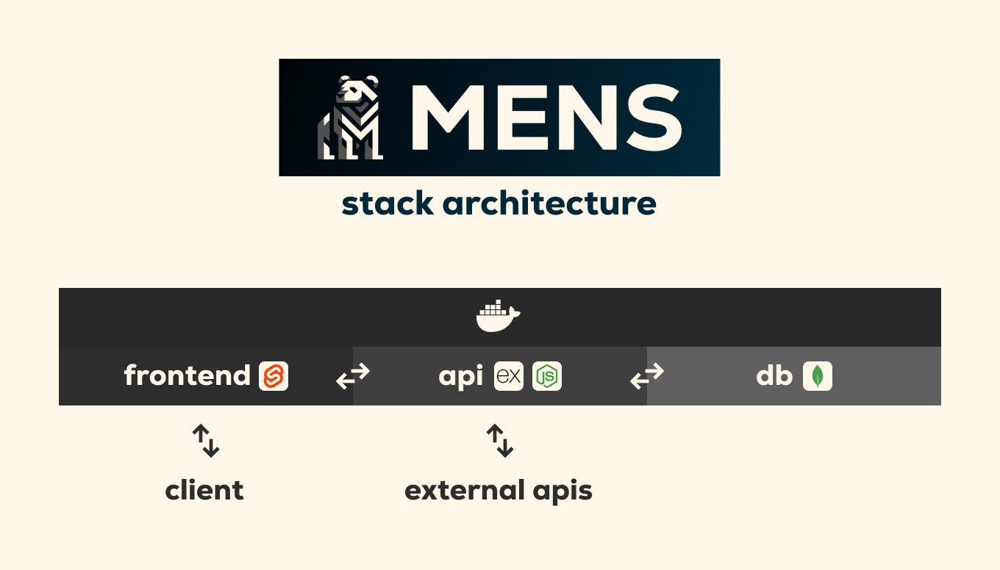

<p align="center"></p>

# MENS stack

[![License: MIT][MIT]](https://opensource.org/licenses/MIT)


`Start it simple!`

## Description

MENS stack project is docker-compose infrastructure for running MongoDB, Express, NodeJS and SveteKIT. Purpose of this project is to provide a simple way to run all stack in one command.

> **Note:**
> MENS includes 2 environment modes `dev` and `prod`, so you do not need to configure it manually! When your project is ready - fill free to deploy it on your server with `prod` mode!

## Requirements

1. Install docker daemon

    + [Docker for Windows](https://docs.docker.com/docker-for-windows/install/)
    + [Docker for Mac](https://docs.docker.com/docker-for-mac/install/)
    + [Docker for Linux](https://docs.docker.com/engine/install/)

## Installation

1. Clone the repository `git clone https://github.com/apparatAndrii/MENS.git`
2. Run `cd MENS`
3. Choose environment mode `dev` or `prod` in `.env` file
4. Run `docker-compose up -d` in the root directory of the project
5. Enjoy!

## Architecture

<p align="center"></p>

## Stack

[![MongoDB]](https://www.mongodb.com/)
[![Express]](https://expressjs.com/)
[![NodeJS]](https://nodejs.org/en/)
[![SvelteKit]](https://kit.svelte.dev/)
[![Docker]](https://www.docker.com/)
[![TypeScript]](https://www.typescriptlang.org/)
[![ESLint]](https://eslint.org/)
[![Prettier]](https://prettier.io/)
[![Vite]](https://vitejs.dev/)

## Structure

```yaml

├── .env # Environment variables
├── .gitignore # Git ignore file
├── docker-compose.yml # Docker compose file
├── README.md # This file
├── frontend/ # SvelteKit frontend
├── api/ # Express API
└── mongo-data/ # MongoDB data directory (ingored by git)

```

## Enviroment variables

<details>

<summary><strong>GENERAL</strong></summary><br>

> **`ENVIRONMENT`** `Environment` *'dev' or 'prod'*

</details>

<details>

<summary><strong>DOCKER</strong></summary><br>

> **`DOCKER_COMPOSE_VERSION`** `Docker compose version` *'default: 3.8'*

</details>

<details>

<summary><strong>NODEJS</strong></summary><br>

> **`NODE_VERSION`** `NodeJS version` *'default: 18'*

</details>

<details>

<summary><strong>FRONTEND</strong></summary><br>

> **`FRONTEND_PORT`** `Frontend port` *'default: 80'*

</details>

<details>

<summary><strong>API</strong></summary><br>

> **`API_PORT`** `API port` *'default: 3000'*

</details>

<details>

<summary><strong>MONGODB</strong></summary><br>

> **`MONGO_PORT`** `MongoDB port` *'default: 27017'*
>
> **`MONGO_USERNAME`** `MongoDB username` *'default: admin'*
>
> **`MONGO_PASSWORD`** `MongoDB password` *'default: admin'*
>
> **`MONGO_DATABASE`** `MongoDB database` *'default: test'*

</details>

## Authors

[![BuiltBy]](https://github.com/apparatAndrii)

#### If you want to support my work, you can wisit my telegram channel and subscribe to it!

[![Telegram]](https://t.me/npm_run_boost)

[BuiltBy]: https://img.shields.io/badge/Developed%20by-Andrii%20Afanasiev-black?style=for-the-badge&logo=github&logoColor=FFF7E9&color=0A0A0A
[Telegram]: https://img.shields.io/badge/Telegram-npm%20run%20boost-FFF7E9?style=for-the-badge&logo=telegram&logoColor=FFF7E9&color=0A0A0A
[MIT]: https://img.shields.io/badge/License-MIT-FFF7E9.svg?style=for-the-badge

[MongoDB]: https://img.shields.io/badge/MongoDB-black.svg?style=for-the-badge&logo=mongodb
[Express]: https://img.shields.io/badge/Express-black.svg?style=for-the-badge&logo=express
[NodeJS]: https://img.shields.io/badge/NodeJS-black.svg?style=for-the-badge&logo=node.js
[SvelteKit]: https://img.shields.io/badge/SvelteKit-black.svg?style=for-the-badge&logo=svelte
[Docker]: https://img.shields.io/badge/Docker-black.svg?style=for-the-badge&logo=docker
[TypeScript]: https://img.shields.io/badge/TypeScript-black.svg?style=for-the-badge&logo=typescript
[ESLint]: https://img.shields.io/badge/ESLint-black.svg?style=for-the-badge&logo=eslint
[Prettier]: https://img.shields.io/badge/Prettier-black.svg?style=for-the-badge&logo=prettier
[Vite]: https://img.shields.io/badge/Vite-black.svg?style=for-the-badge&logo=vite
